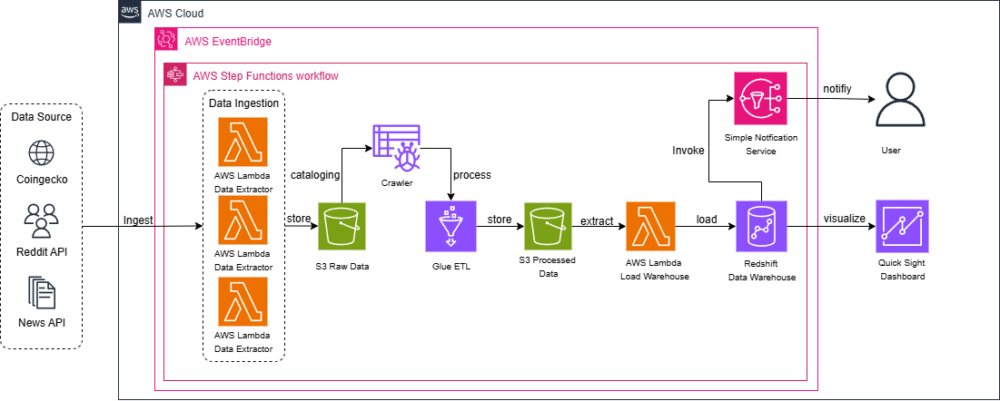
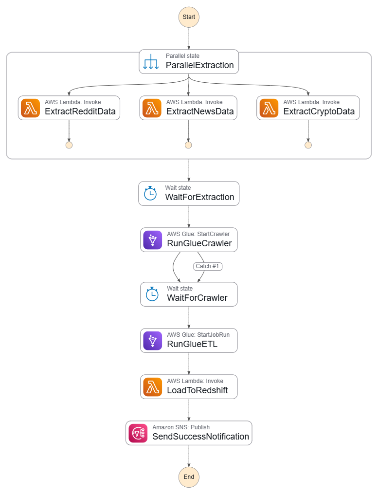

# Social Media Analytics Data Warehouse

[](https://aws.amazon.com)
[](https://www.python.org/)


---

## 📊 Project Overview

A fully automated data warehouse that:
- **Extracts** data from 3 public APIs (Reddit, News API, CoinGecko)
- **Transforms** raw JSON into dimensional models using AWS Glue
- **Loads** data into Amazon Redshift for analytics
- **Visualizes** insights through Amazon QuickSight dashboards


---

## Architecture

- **Architecture**


- **Data Pipeline**


### Technology Stack

| Layer | Technology | Purpose |
|-------|-----------|---------|
| **Orchestration** | AWS Step Functions | Workflow automation |
| **Extraction** | AWS Lambda (Python 3.9) | Serverless data extraction |
| **Storage** | Amazon S3 | Scalable data lake |
| **Cataloging** | AWS Glue Crawler | Automatic schema discovery |
| **Transformation** | AWS Glue (PySpark) | ETL processing |
| **Data Warehouse** | Amazon Redshift | Columnar analytics database |
| **Visualization** | Amazon QuickSight | BI dashboards |
| **Monitoring** | CloudWatch + SNS | Logging and alerting |

---

## Data Model

**Dimensional Model**: Star Schema

### Fact Tables
- `fact.engagement_fact` - Reddit post engagement metrics
- `fact.news_fact` - News article metrics
- `fact.crypto_price_fact` - Cryptocurrency price history

### Dimension Tables
- `dim.date_dim` - Calendar dimension
- `dim.content_dim` - Reddit post metadata
- `dim.news_dim` - News article information
- `dim.crypto_dim` - Cryptocurrency details


---

## Features

### Data Pipeline
- Multi-source data integration (3 APIs)
- Automated daily extraction via EventBridge
- Schema evolution handling with Glue Crawler
- Dimensional modeling (Star Schema)
- Incremental data loading

### Infrastructure
- Serverless architecture (Lambda + Glue)
- S3 lifecycle policies for cost optimization
- Redshift auto-pause/resume

### Monitoring & Operations
- CloudWatch dashboards
- SNS email notifications

---

##  Sample Analytics

### Top Performing Subreddits
```sql
SELECT 
    subreddit,
    AVG(engagement_score) as avg_engagement,
    SUM(upvotes) as total_upvotes
FROM fact.engagement_fact ef
JOIN dim.content_dim cd ON ef.content_key = cd.content_key
GROUP BY subreddit
ORDER BY avg_engagement DESC
LIMIT 10;
```

### Crypto Market Trends
```sql
SELECT 
    name,
    current_price,
    price_change_percentage_24h
FROM fact.crypto_price_fact cf
JOIN dim.crypto_dim cd ON cf.crypto_key = cd.crypto_key
WHERE date_key = (SELECT MAX(date_key) FROM fact.crypto_price_fact)
ORDER BY market_cap DESC
LIMIT 20;
```


##  Technical Implementation

### Lambda Functions
**Language**: Python 3.12  
**Libraries**: boto3, requests  

- `reddit-data-extractor`: Extracts posts from Reddit API (OAuth 2.0)
- `news-data-extractor`: Pulls headlines from News API
- `crypto-data-extractor`: Fetches prices from CoinGecko API

### Glue ETL Job
**Framework**: PySpark  
**Glue Version**: 5.0  
**Workers**: 5 G.1X

Transforms raw JSON into dimensional model:
- Generates surrogate keys using hash functions
- Creates date dimensions programmatically
- Handles null values and data quality
- Outputs Parquet files for efficient querying


## 📚 Setup Instructions

### Prerequisites
- AWS Account with billing enabled
- Python 3.12+
- Reddit API credentials ([free developer account](https://www.reddit.com/prefs/apps))
- News API key (free tier)


